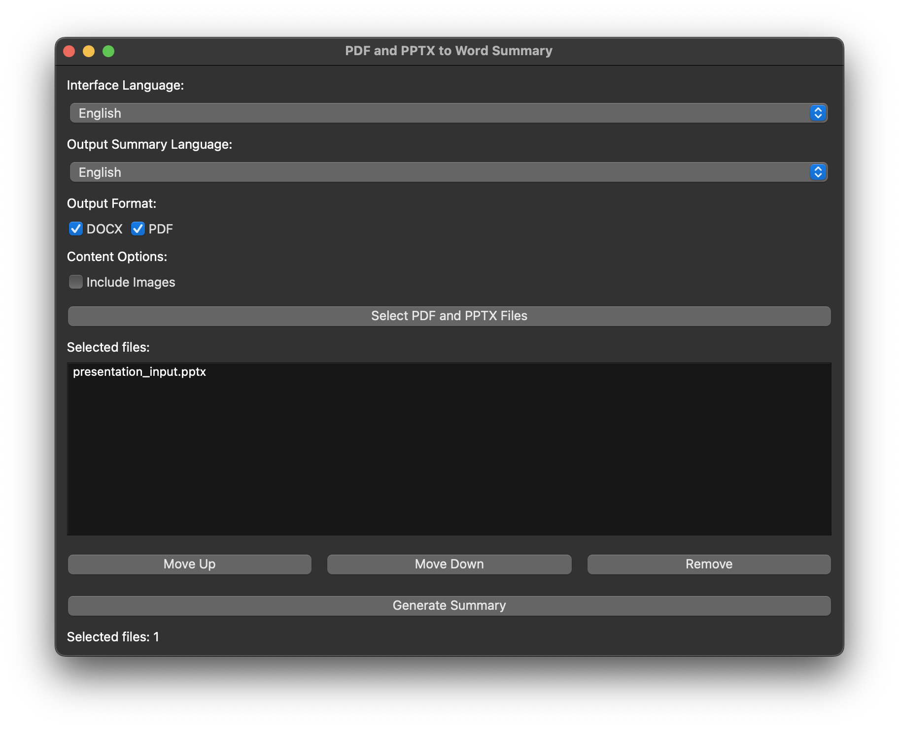
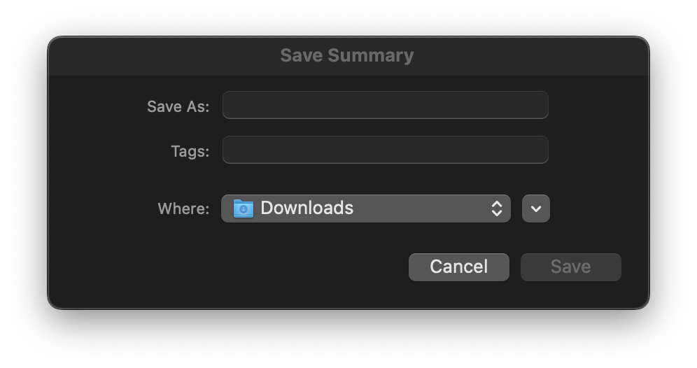

# Generate Document Notes from Slides

A PyQt6 application that generates summaries of PDF and PPTX files using the Google Gemini API.  The application allows users to select multiple files, specify the output language and format (DOCX or PDF), and choose whether to include image descriptions in the summary.

## Introduction

This project provides a user-friendly graphical interface (GUI) built with PyQt6 for summarizing documents. It leverages the Google Gemini API (requires API key and model URL) to generate comprehensive summaries, incorporating text, notes, and image descriptions from PDF and PPTX files. The summaries can be saved as DOCX or PDF files.

## Features

- Supports PDF and PPTX files:  Processes both PDF and PPTX documents, extracting text and images.
- Gemini API Integration: Uses the Google Gemini API for accurate and detailed summarization.
- Multilingual Support:  Allows users to select the output language for the summary.
- Multiple File Selection: Enables users to select and process multiple files simultaneously.
- Output Format Selection:  Offers the choice to save the summary as a DOCX or PDF file.
- Image Description Inclusion (Optional):  Provides an option to include AI-generated descriptions of images found within the documents.
- GUI-based:  Provides an intuitive graphical user interface for ease of use.
- Multilingual UI: Supports multiple UI languages (English, French, Spanish, Italian).
- File Reordering: Allows users to reorder selected files before processing.


## Installation

1. Clone the repository:
   ```bash
   git clone https://github.com/leobargiotti/Slide2Notes
   ```
2. Create a virtual environment (recommended):
   ```bash
   python3 -m venv venv
   source venv/bin/activate  # On Windows: venv\Scripts\activate
   ```
3. Install dependencies:
   ```bash
   pip install -r requirements.txt
   ```
4. Set environment variables: Create a `.env` file in the root directory (or use a different method to set environment variables) and add your Google Gemini API key and model URL:
   ```
   GOOGLE_MODEL=<your_gemini_model_url>
   API_KEY=<your_gemini_api_key>
   ```


## Usage

Run the application using:

```bash
python src/app.py
```

The GUI will appear, allowing you to select files, choose options, and generate the summary.


## Project Structure

- [src/](./src): Contains the source code.
    - [src/app.py](./src/app.py): The main application file.  
    - [src/utils.py](./src/utils.py): Utility functions for API interaction, file processing, and summary generation. 
    - [src/languages.py](./src/languages.py): Dictionary containing translations for the UI. 
- [example/](./example): Contains example input and output files.
    - [example/presentation_input.pptx](./example/presentation_input.pptx): Example input PPTX file. 
    - [example/presentation_output.docx](./example/presentation_output.docx): Example output DOCX file. 
    - [example/presentation_output.pdf](./example/presentation_output.pdf): Example output PDF file. 
- [images/](./images): Contains screenshots of the application.


## Example Usage

1. Run the application.
2. Click "Select Files" and choose one or more PDF or PPTX files.
3. Select the desired output language.
4. Choose the output format (DOCX or PDF), and optionally select "Include Images".
5. Click "Generate Summary".
6. A file dialog will appear; choose a location and filename to save the summary.

The generated summary will integrate text, notes, and (if selected) image descriptions from the input files into a coherent narrative.


## Screenshot

This is a software interface for generating a word summary from PDF and PPTX files, allowing users to specify language, output format, and content options before generating the summary.



This is a dark-themed pop-up window prompting the user to provide a file name, tags, and location to save a summary.
<p align="center">
    
</p>


