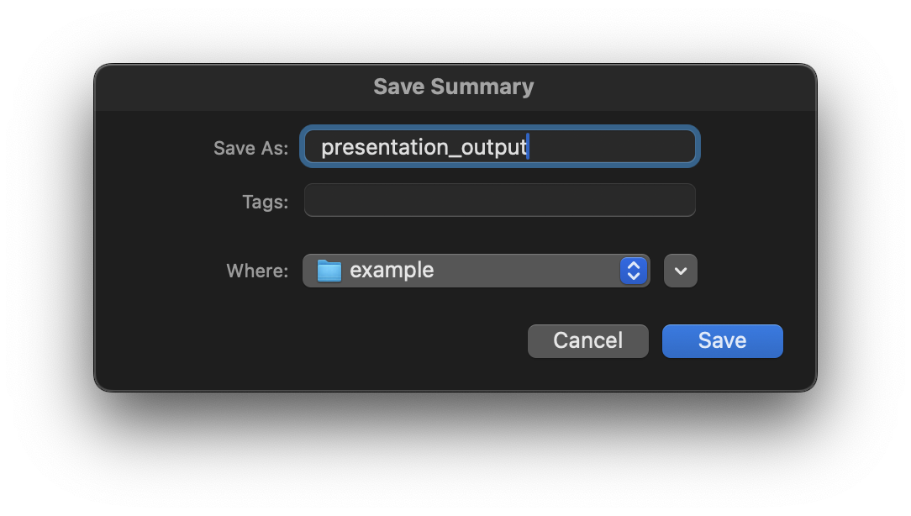

# Generate Document Notes from Slides

This application allows users to generate summary of PDF and PPTX files, translating them into various languages and saving the output as DOCX or PDF documents.  The application incorporates AI to extract text and image descriptions from the input files, providing a comprehensive and detailed summary.

## Introduction

This project provides a user-friendly graphical interface (GUI) built with PyQt6 for summarizing documents. It leverages the Google Gemini API (requires API key and model URL) to generate comprehensive summary, incorporating text, notes, and image descriptions from PDF and PPTX files. The summary can be saved as DOCX or PDF files.

## Features

- Supports PDF and PPTX files:  Process multiple files simultaneously.
- Multilingual support:  Generate summaries in English, French, Spanish, and Italian.
- Multiple output formats: Save summaries as DOCX or PDF files.
- Multiple File Selection: Enables users to select and process multiple files simultaneously.
- Image description generation: Includes AI-generated descriptions of images within the summary (optional).
- User-friendly interface:  Intuitive PyQt6-based graphical user interface.
- File reordering: Allows users to reorder the input files before processing.
- Progress bar: Displays the progress of the summarization process.
- Error handling: Provides informative error messages during file processing.
- Output Format Selection:  Offers the choice to save the summary as a DOCX or PDF file.
- UI Language Selection: Choose between English, French, Spanish, and Italian for the application interface.


## Project Structure

- [src/](./src): Contains the source code.
    - [src/utils.py](./src/utils.py): Contains utility functions for API interaction, file processing, and summary generation.
    - [src/app.py](./src/app.py): Contains the main application logic and user interface.
    - [src/languages.py](./src/languages.py): Contains the translations for the user interface.
- [example/](./example): Contains example input and output files.
    - [example/presentation_input.pptx](./example/presentation_input.pptx): Example input PPTX file.
    - [example/presentation_output.docx](./example/presentation_output.docx): Example output DOCX file.
    - [example/presentation_output.pdf](./example/presentation_output.pdf): Example output PDF file.
- [images/](./images): Contains screenshots of the application.

## Installation

1. Clone the repository:    
    ```bash
    git clone https://github.com/leobargiotti/Slide2Notes
    ```
2. Create a virtual environment (recommended): 
    ```bash 
   python3 -m venv venv 
   ```
3. Activate the virtual environment:
   - Linux/macOS:     
      ```bash 
      source venv/bin/activate
      ```
   - Windows: 
     ```bash 
      source venv\Scripts\activate
      ```
4. Install dependencies: `pip install -r requirements.txt`
5. Set environment variables: Create a `.env` file in the root directory and add your Google Gemini API key and model URL:
   ```
   GOOGLE_MODEL=<your_gemini_model_url>
   API_KEY=<your_gemini_api_key>
   ```
6. Run the application: `python src/app.py`


## Usage

The application provides a graphical user interface.  Follow these steps:

1. Select Files: Click the "Select Files" button to choose the PDF and/or PPTX files you want to summarize.
2. Choose Output Language: Select the desired language for the summary from the "Output Summary Language" dropdown.
3. Select Output Format: Check the "DOCX" and/or "PDF" checkboxes to specify the desired output format(s).
4. Content Options: Check the "Include Images" checkbox to include AI-generated descriptions of images found in the input files.
5. Reorder Files (Optional): Use the "Move Up" and "Move Down" buttons to change the order of files in the processing queue.
6. Remove Files (Optional): Use the "Remove" button to delete files from the queue.
7. Generate Summary: Click the "Generate Summary" button to start the summarization process. A progress bar will indicate the progress.
8. Save Summary: A save dialog will appear, allowing you to choose the location and filename for the generated file.


## Screenshot

This section contains screenshots of the application's interface.

This is a software interface for generating a DOCX summary and PDF from PPTX files, allowing users to specify language, output format, and content options before generating the summary.


The image shows the interface currently processing a PPTX file to generate a DOCX and PDF summary with a progress bar.


This the pop-up window prompting the user to provide a file name, tags, and location to save a summary.

<p align="center">
    
</p>

